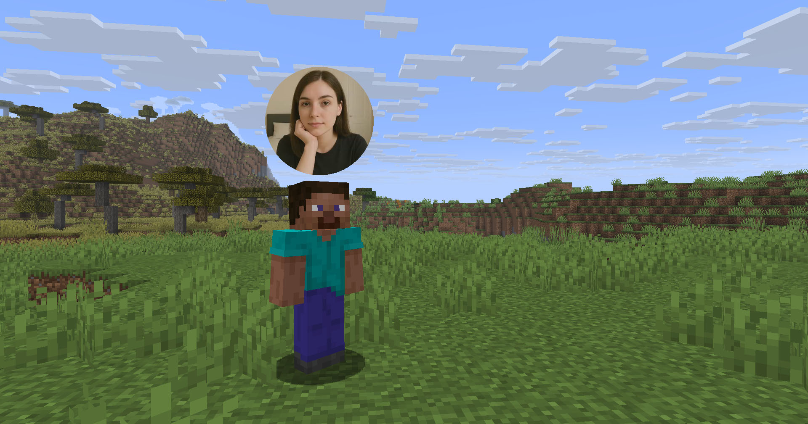

# Webcam

Mod and plugin that allows players to broadcast their webcams <p>



## Warning

This project is new and may not work well. Please submit an issue if you find a bug

## Usage

For the server, see `Setup on server`

For the client, just put the mod in the `mods` directory with the Fabric API. The settings menu can be opened by hotkey (`C` by default)


## Icons

|                           Icon                           | Description                    |
|:--------------------------------------------------------:|--------------------------------|
|                              | Your webcam is enabled         |
|            | Your webcam is disabled        |
|        | Connecting to Webcam server    |
|  | Not connected to Webcam server |

## Encryption

Webcam connection is encrypted, but we don't guarantee the security of it. Use at your own risk!

## Setup on server

You need to open port on your server to make Webcam server work. This is port `25454`/`udp` by default. You can change the port in server config

### Config

Server config is located in `config/webcam/server.json` <p>
Here are the default values with their descriptions: <p>
```
{
  "port": 25454, // Webcam UDP server port. This must not clash with Minecraft port (usually 25565) or any other (like Simple Voice Chat port)
  "bind_address": "", // Address to bind server to. Leave blank to use server-ip property from the server.properties
  "host": "", // The hostname that clients should use to connect to the Webcam server
  "keep_alive_period": 1000, // Period of sending keep alive packets
  "max_display_distance": 100.0, // The distance in blocks from player, in which other players can see his webcam
  "display_on_face": false, // Whether to display webcam on player model face or above his head
  "display_shape": "round", // Shape of webcams displayed above players' head. Possible values: "round", "square"
  "display_offset_y": 1.2, // Y offset of webcams displayed above players' head
  "display_size": 1.2, // Size of webcams displayed above players' head
  "hide_nicknames": true, // Whether to hide player's nickname if his webcam is enabled
  "synced": { // These settings are synchronized with clients
    "image_dimension": 360, // Side dimension of square webcam images. (High values may cause lags)
    "mtu": 1300 // Maximum Transmission Unit of packets. You shouldn't change this
  }
}
```

### Commands

- `/webcamconfig <field> [new_value]` - command to read/update config values. Not all values can be changed with it. Requires `webcam.command.config` permission or OP.

### Permissions

- `webcam.command.config` - permission to modify Webcam server config