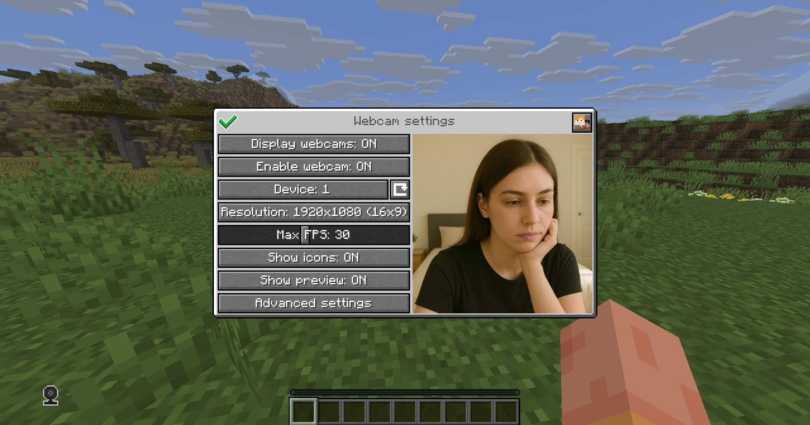

# Webcam

Mod and plugin that allows players to broadcast their webcams  

## Downloads

- [Fabric / Quilt](https://modrinth.com/mod/webcam-mod/versions?l=fabric)
- [Bukkit / Spigot / Paper](https://modrinth.com/plugin/webcam-mod/versions?l=bukkit)
- [Velocity](https://modrinth.com/mod/webcam-mod/versions?l=velocity)

## Features

- High-quality webcam broadcasting
- H.264 video codec
- Bitrate control
- Video resolution control
- Different display shapes
- Display size and position configuration
- Display on player model face
- Display distance limit
- Webcam broadcast and view permissions
- Advanced client configuration ([Mod Menu](https://modrinth.com/mod/modmenu) & [Cloth Config API](https://modrinth.com/mod/cloth-config) required)
- Ability to hide all webcams
- Ability to hide selected players' webcams
- Velocity proxy support


## Warning

This project is new and may not work well. Please [**submit an issue**](https://github.com/DimasKama/Webcam/issues/new) if you find a bug

## Client Usage

Put the mod in the `mods` directory with the Fabric API. The settings menu can be opened by hotkey (`C` by default)



## Icons

|                           Icon                           | Description                    |
|:--------------------------------------------------------:|--------------------------------|
|                              | Your webcam is enabled         |
|            | Your webcam is disabled        |
|        | Connecting to Webcam server    |
|  | Not connected to Webcam server |

## Encryption

Webcam connection is encrypted, but we don't guarantee the security of it. Use at your own risk!

## Setup on server

Webcam server works as a separate UDP server.  
So you need to open port in your server's firewall and panel (if present) to make Webcam server work. This is port `25454/udp` by default. You can change the port in server config    
If you are using Velocity, see `Setup on proxy`

### Server config

Location:
- Fabric / Quilt: `config/webcam/server.json`
- Bukkit / Spigot / Paper: `plugins/webcam/server.json`

Here are the default values with their descriptions:  
```
{
  "port": 25454,                 // Webcam UDP server port. This must not clash with any other used UDP port (like Simple Voice Chat port)
  "bind_address": "",            // Address to bind the Webcam server to. Leave blank to use the wildcard (0.0.0.0) address. F.e. use "127.0.0.1" to accept only local connections
  "host": "",                    // The hostname that clients should use to connect to the Webcam server. Leave blank to use the address, that player is connected to Minecraft with. Can be a simple address or an address with port. This will be ignored, if the server is proxied
  "keep_alive_period": 1000,     // Period of sending keep alive packets is milliseconds
  "permission_check_period": 60, // Period of checking webcam.broadcast and webcam.view permissions in ticks
  "max_display_distance": 100.0, // The distance in blocks from player, in which other players can see his webcam
  "display_on_face": false,      // Whether to display webcam on player model face or above his head
  "display_shape": "round",      // Shape of webcams displayed above players' head. Possible values: "round", "square"
  "display_offset_y": 1.2,       // Y offset of webcams displayed above players' head
  "display_size": 1.2,           // Size of webcams displayed above players' head
  "hide_nicknames": true,        // Whether to hide player's nickname if his webcam is enabled
  "display_self_webcam": false,  // Whether to show the player's webcam to himself
  "synced": {                    // These settings are synchronized with clients
    "image_dimension": 360,      // Side dimension of square webcam images
    "mtu": 1100,                 // Maximum Transmission Unit of packets. You can lower this, if image on webcam starts look glitchy or not arrives at all
    "bitrate": 500               // Target video bitrate (kbps)
  },
  "messages": {                  // Custom transtalions for messages, that are sent to players in different situations. May contain placeholders - %s
    "incompatible_mod_version": "Incompatible Webcam version. Your - %s, server's - %s" // The message that will be sent to player if he has incompatible Webcam mod version. You can set this to empty to disable sending this message
  }
}
```

### Commands

- `/webcamconfig <field> [new_value]` - command to read/update config values. Requires `webcam.command.config` permission or OP.

### Permissions

- `webcam.command.config` - permission to modify Webcam server config (default: OP Level)
- `webcam.broadcast` - permission to broadcast webcam (default: true)
- `webcam.view` - permission to view webcams (default: true)

## Setup on proxy

Webcam has Velocity plugin that proxies Webcam servers on the backend MC servers and allows to connect to different Webcam servers through the single port.  
So it acts like a UDP proxy.  
If you running proxy and backend servers on the same machine, you need to configure different ports for them. See `Setup on server/Server config` and `Setup on proxy/Proxy config`  

### Proxy config

Server config is located in `plugins/webcam/config.properties`  
Here are the default values with their descriptions:  
```
#Webcam proxy config

# Webcam UDP server port. This must not clash with any other used UDP port (like Simple Voice Chat port)
port=25454

# Address to bind the Webcam server to. Leave blank to use the wildcard (0.0.0.0) address. F.e. use "127.0.0.1" to accept only local connections
bind_address=

# The hostname that clients should use to connect to the Webcam server. Leave blank to use the address, that player is connected to Minecraft with. Can be a simple address or an address with port. This will override configured values on backend server's
host=
```